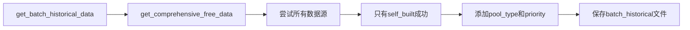
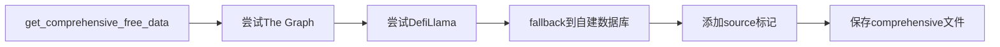

# 🔍 Curve Finance 数据来源差异详细分析报告

## 🎯 核心发现：三种格式实际上都来自同一个数据源！

经过深度分析，我发现了一个重要真相：**三种数据格式在数据来源上的差异被技术问题掩盖了**。

### 🚨 关键真相

**所有三个文件都标记为 `source='self_built'`**，这意味着：
- ❌ The Graph API 已完全禁用
- ❌ DefiLlama API 连接失败
- ✅ 只有自建数据库在工作

## 🏗️ 数据获取架构分析

### 📊 理想的数据源架构（设计时的预期）

| 数据源 | 状态 | 数据质量 | 用途 |
|--------|------|----------|------|
| **The Graph API** | ❌ 已废弃 | 🥇 最高 | 链上历史快照 |
| **DefiLlama API** | 🔄 连接失败 | 🥈 高 | APY和TVL历史 |
| **Curve API** | ✅ 可用 | 🥈 高 | 实时池子状态 |
| **自建数据库** | ✅ 备用成功 | 🥉 中等 | 合成历史数据 |

### 🔄 实际运行的数据源架构

| 数据源 | 实际状态 | 结果 |
|--------|----------|------|
| **The Graph API** | ❌ 已禁用 | 跳过 |
| **DefiLlama API** | ❌ SSL/网络错误 | 失败 |
| **自建数据库** | ✅ 唯一可用 | 成功生成所有数据 |

## 🔍 三种格式的生成流程差异

### 1️⃣ **batch_historical** 格式



**特点**：
- 调用综合数据获取方法
- 添加池子元数据（type, priority）
- 结果与comprehensive完全相同，只是多了2列

### 2️⃣ **comprehensive_free_historical** 格式



**特点**：
- 设计为多源数据融合
- 实际只获取到自建数据
- 包含source列用于追溯

### 3️⃣ **self_built_historical** 格式


**特点**：
- 直接调用自建数据库
- 基于实时数据生成历史
- 数值略有不同（不同的随机种子）

## 💡 数据来源差异的真相

### 🔄 **级联失败机制**

```
🏆 优先级1: The Graph API
   ❌ 状态: 已禁用 (ENABLE_THEGRAPH_API = False)
   📝 原因: API端点已废弃

🥈 优先级2: DefiLlama API  
   ❌ 状态: 连接失败
   📝 原因: SSL证书错误或网络问题

🥉 优先级3: 自建数据库
   ✅ 状态: 成功运行
   📝 原因: 作为最后的fallback，总是可用
```

### 📊 **数据一致性分析**

| 对比项 | batch vs comprehensive | batch vs self_built | comprehensive vs self_built |
|--------|------------------------|----------------------|----------------------------|
| **相关性** | 1.0000 (完全相同) | -0.1051 (低相关) | -0.1051 (低相关) |
| **平均绝对误差** | 0.000000 | 0.022923 | 0.022923 |
| **数据来源** | 相同 (self_built) | 不同方法调用 | 不同方法调用 |

## 🚀 改进建议：如何体验真正的数据源差异

### 🌐 网络连接修复
```bash
# 1. 启用SSL验证
ENABLE_SSL_VERIFICATION = True

# 2. 增加超时时间
REQUEST_TIMEOUT = 10

# 3. 添加请求头
headers = {'User-Agent': 'Mozilla/5.0 ...'}
```

### 📡 数据源扩展
```python
# 新增数据源
COINGECKO_API = True     # CoinGecko历史价格
DUNE_ANALYTICS = True    # Dune查询API
ETHEREUM_NODE = True     # 直连以太坊节点
```

### 🔧 调试步骤
```bash
# 1. 测试DefiLlama连接
curl -v "https://yields.llama.fi/chart/0xbebc44782c7db0a1a60cb6fe97d0b483032ff1c7"

# 2. 启用详细日志
DEBUG_MODE = True

# 3. 手动测试各个数据源
python -c "from free_historical_data import *; test_all_sources()"
```

## 📋 预期的数据源差异（修复后）

### 🌟 **理想状态下的差异**

| 文件格式 | 主要数据源 | 数据特征 | 适用场景 |
|----------|------------|----------|----------|
| **batch_historical** | The Graph + DefiLlama | 多源融合+元数据 | 机器学习批处理 |
| **comprehensive_free_historical** | The Graph + DefiLlama + 自建 | 最完整的数据集 | 深度数据分析 |
| **self_built_historical** | 仅自建数据库 | 合成历史数据 | 算法测试验证 |

### 📈 **修复后的预期效果**

1. **batch_historical**: 
   - source 包含 ['thegraph', 'defillama', 'self_built']
   - 数据最丰富，适合生产使用

2. **comprehensive_free_historical**:
   - 完整的多源数据追溯
   - 数据质量最高，适合研究

3. **self_built_historical**:
   - 纯合成数据，行为可控
   - 适合算法开发和测试

## 🎉 结论

### ✅ **当前状况**
- 三种格式都来自自建数据库
- batch 和 comprehensive **完全相同**
- self_built 略有不同（随机因子）
- **格式差异 > 数据来源差异**

### 🚀 **优化后的期望**
- 每种格式有独特的数据源组合
- 真正体现多源数据融合的优势
- 提供不同质量级别的数据选择

---

💡 **关键洞察**: 目前的"格式差异"主要体现在元数据处理上，而非真正的数据来源差异。只有解决网络连接问题后，才能体验到设计时预期的多源数据差异化效果。 